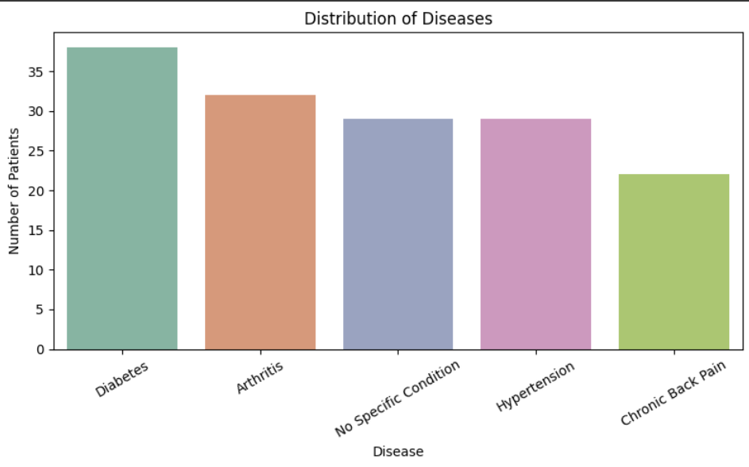
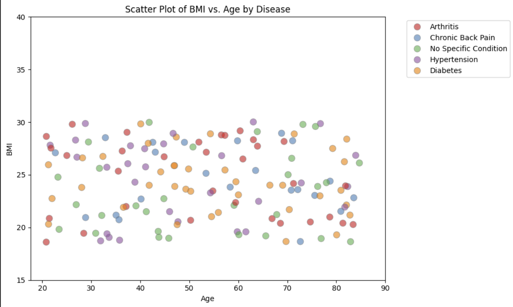
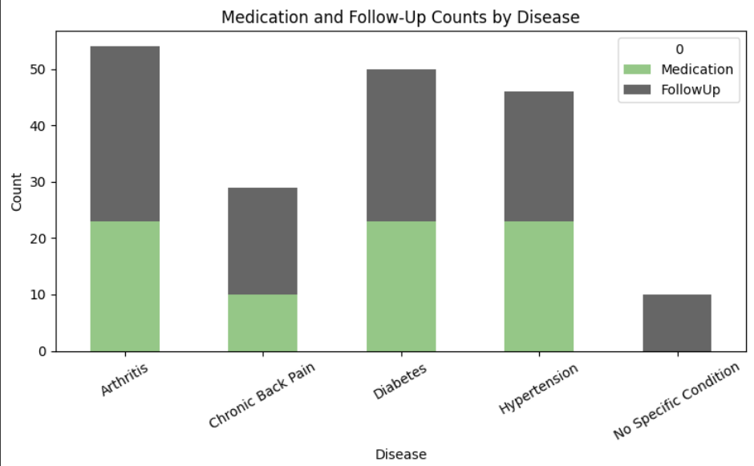
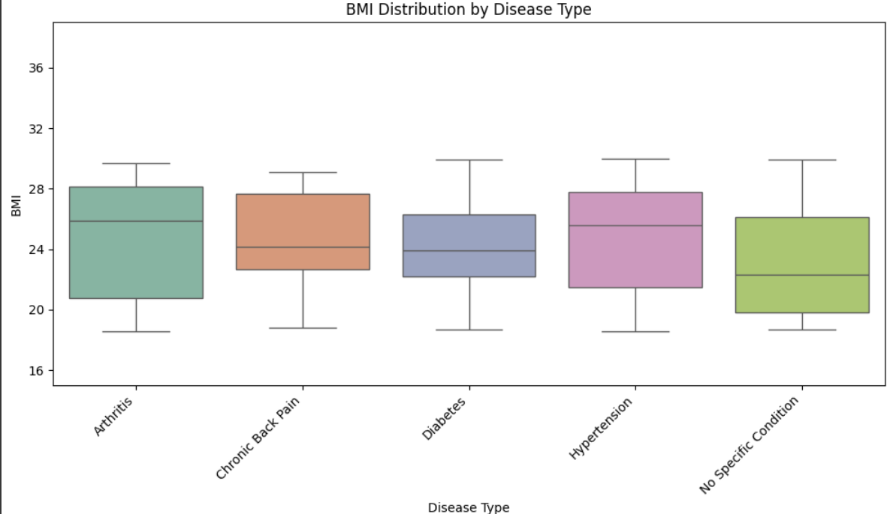
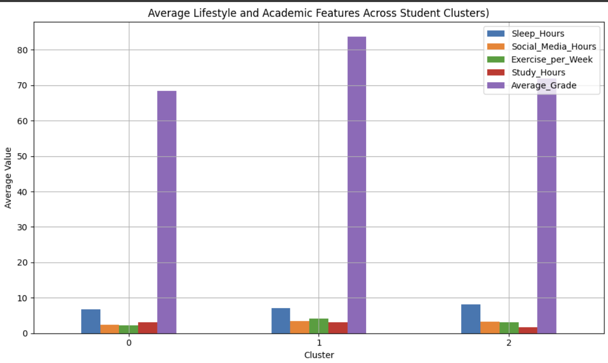
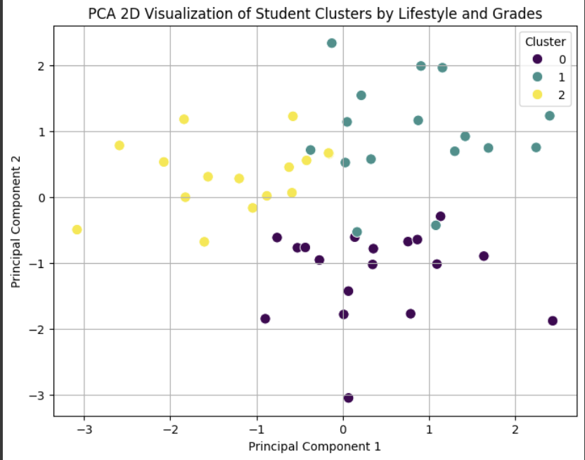

# 1132程式語言
## 作業
HW1程式碼:[HW1](https://github.com/PhoebeLu1011/1132code/blob/main/1132code_hw1.ipynb)
## HW2-病患資料視覺化
此作業視覺化了包含 150 筆病患紀錄的資料集。專案目標是探索各種健康因素（例如年齡、BMI、疾病、用藥與追蹤等）之間的關聯。
### 程式碼
[程式碼](https://github.com/PhoebeLu1011/1132code/blob/main/HW2.ipynb)
### 數據
[導入的數據](https://github.com/PhoebeLu1011/1132code/blob/main/%E4%BD%9C%E6%A5%AD%E4%BA%8C%20-%20%E5%B7%A5%E4%BD%9C%E8%A1%A81.csv)\
數據包含以下欄位：
- **PatientID**：病患的代碼。
- **Age**：病患的年齡。
- **BMI**：病患的身體質量指數。
- **Disease**：病患的健康狀況（例如糖尿病、高血壓、關節炎等）。
- **Medication**：病患是否在服用藥物（0 代表沒有，1 代表有）。
- **Rehabilitation**：病患是否進行復健治療（0 代表沒有，1 代表有）。
- **FollowUp**：病患是否有追蹤門診（0 代表沒有，1 代表有）
#### 圖表與說明
1. 疾病分布（Bar Chart）
此長條圖顯示了各種疾病在所有病患中的分布情況。

此圖表顯示各疾病類型出現的頻率。可以看出某些疾病如 Diabetes 比較常見 ，顯示在此資料中，患有 Diabetes的人比例較高
3. BMI 與年齡散佈圖
此圖顯示了 **年齡** 與 **BMI** 之間的關係，並且使用顏色區分不同疾病類型。

此圖顯示病患 BMI 分布較分散，並無明顯線性趨勢，但部分慢性病患者的 BMI 明顯偏高，可能與生活型態或年齡相關。
4. 各疾病的用藥與追蹤情況（堆疊長條圖）
此堆疊長條圖顯示了不同疾病病患的 **用藥** 和 **追蹤治療** 情況。

此圖表示不同疾病的用藥與追蹤治療情況。可以看出例如 Arthritis 與 Diabetes 有較高的用藥與追蹤比例，顯示這些病症可能需要長期控制與治療。
5. 不同疾病類型與BMI的箱型圖
此箱型圖展示了 **不同疾病類型（Disease）** 下的 **BMI** 分布情況。

由圖可以看出，高 BMI 與多種慢性疾病（如糖尿病和高血壓）之間有一定的關聯。


## HW3-學生生活習慣與成績分群分析
本作業使用 Python 分析學生的生活習慣，包括睡眠、社群媒體使用、運動頻率、讀書時數與成績等統計指標，利用 KMeans 聚類與 PCA 降維分析分群成三種類型的學生，並使用視覺化工具展示結果。

### 程式碼解釋
1. 串接Colab與google帳號，以`gspread` 函式庫操作Google Sheets
```python
from google.colab import auth
auth.authenticate_user()
import gspread
from google.auth import default
creds, _ = default()
gc = gspread.authorize(creds)
```
2. 讀取Google sheets 中的資料並轉成pandas 的 DataFrame
```python
gsheets = gc.open_by_url('https://docs.google.com/spreadsheets/d/1W8M_DmUTvav6yeYFs_1e7gdO5DX-d55vePejUNkAEJw/edit?usp=sharing').sheet1
dicts = gc.open_by_url('https://docs.google.com/spreadsheets/d/1W8M_DmUTvav6yeYFs_1e7gdO5DX-d55vePejUNkAEJw/edit?usp=sharing').get_worksheet(0)
dicts = dicts.get_all_records()
dicts = pd.DataFrame(dicts)
rows = gsheets.get_all_records()
df = pd.DataFrame(rows)
```
3. 欄位重新命名
```python
df = df.rename(columns={
    '學生編號': 'Student_ID',
    '睡眠時間_每日(小時)': 'Sleep_Hours',
    '社群媒體使用_每日(小時)': 'Social_Media_Hours',
    '運動頻率_每週(次)': 'Exercise_per_Week',
    '讀書時間_每日(小時)': 'Study_Hours',
    '平均成績': 'Average_Grade'
```
4. 資料標準化—把每個項目轉為平均值為 0、標準差為 1，讓不同尺度的資料可以以相同單位進行分析。
```python
eatures = ['Sleep_Hours', 'Social_Media_Hours', 'Exercise_per_Week', 'Study_Hours', 'Average_Grade']
X = df[features]
scaler = StandardScaler()
X_scaled = scaler.fit_transform(X)
```
5. KMeans 分群分析-根據學生的行為與表現將其分為3群
```
kmeans = KMeans(n_clusters=3, random_state=42)
clusters = kmeans.fit_predict(X_scaled)
df['Cluster'] = clusters
```
6. 長條圖-顯示每群的平均特徵
```
group_means = df.groupby('Cluster')[features].mean()
group_means.plot(kind='bar', figsize=(10,6))
plt.title('Average Features by Cluster')
plt.ylabel('Average Value')
plt.xlabel('Cluster')
plt.xticks(rotation=0)
plt.grid(True)
plt.legend(loc='upper right')
plt.tight_layout()
plt.show()
group_means = df.groupby('Cluster')[features].mean()
print(group_means)
```
7. PCA 降維-將資料轉成2維，以散狀圖顯示學生分佈情形
```
pca = PCA(n_components=2)
X_pca = pca.fit_transform(X_scaled)
plt.figure(figsize=(8,6))
sns.scatterplot(x=X_pca[:,0], y=X_pca[:,1], hue=df['Cluster'], palette='viridis', s=80)
plt.title('PCA 2D Cluster Visualization')
plt.xlabel('Principal Component 1')
plt.ylabel('Principal Component 2')
plt.grid(True)
plt.legend(title='Cluster')
plt.show()
```
### 圖表解釋與分析

KMEANS 長條圖分析:\
●Cluster 0\
睡眠時間：偏少（7 小時）

社群媒體：使用最少（2 小時）

運動頻率：最高（3.5 次/週）

讀書時間：最多（3 小時/天）

成績：最低（68 分）

分析：\
可看出雖然這群學生生活規律、運動多、社群媒體使用少，讀書時間也不少，但可能因為學習方法錯誤或壓力因素導致成績不理想。

●Cluster 1\
睡眠時間：適中（7.5 小時）

社群媒體：使用最多（3.5 小時）

運動頻率：中等（3 次/週）

讀書時間：中等（2.5 小時）

成績：最高（84 分）

分析：\
這群學生有良好的生活平衡，雖然使用社群媒體的時間最多，但可能因為有良好的時間管理能力，所以整體表現仍最佳。

●Cluster 2\
睡眠時間：最多（8 小時）

社群媒體：中等（2.5 小時）

運動與讀書時間：都偏少（2.5 與 2 小時）

成績：中等（76 分）

分析：\
這群學生睡得最多，但運動與讀書時間都偏少，成績介於中間。


\
PCA降維圖表分析 : \
●Cluster 0（深紫色）

1. 分布位置 : 左下

2. 在第一軸和第二軸上的數值偏低

3. 解釋 ：　這群學生可能整體能力較弱，需要補救教學或其他學習資源輔助學習

●Cluster 1（綠藍色）

1. 分布位置 : 右上

2. 在第一軸與第二軸數值皆偏高

3. 解釋 ：　這群學生在兩個維度上都有良好的表現，可以給予更進階的學習資源或具挑戰性的任務。

●Cluster 2（黃色）

1. 分布位置 : 中間偏左上

2. 第一軸較低，第二軸數值偏高

3. 解釋 :　這群學生可能偏科，可以依照擅長的繼續專精
